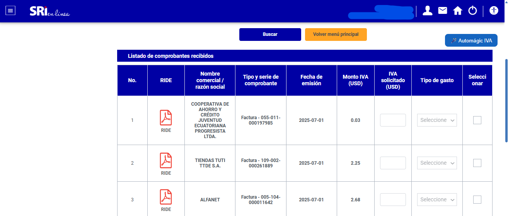
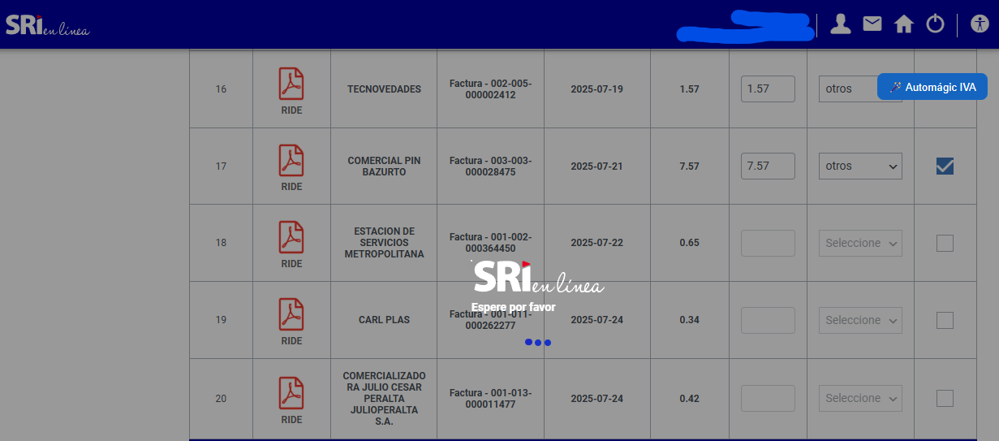
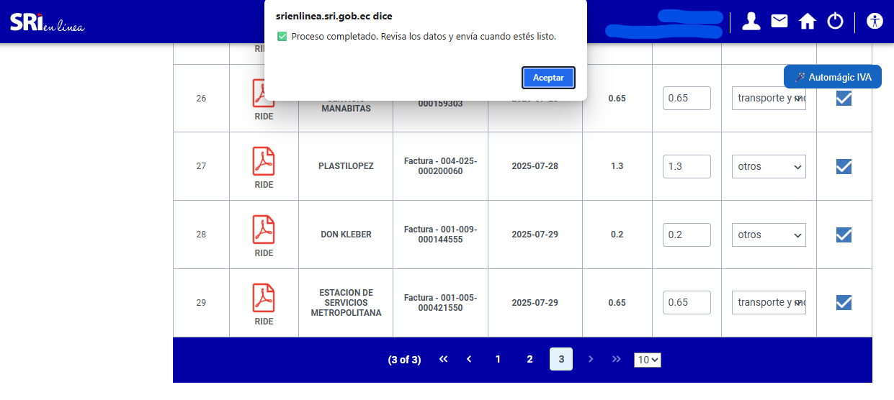

# 🪄 Automágic IVA SRI (Full PrimeFaces)

Automatiza la selección y clasificación de facturas para devolución de IVA en el portal SRI (Ecuador).  
Marca facturas, selecciona automáticamente el tipo de gasto correcto y navega por todas las páginas de resultados, optimizando procesos administrativos repetitivos y reduciendo a un 80% el trabajo manual.

---

## 🚀 Características principales

- Selección automática de facturas en el SRI
- Clasificación inteligente de tipo de gasto (alimentación, salud, educación, etc.)
- Compatible con interfaces PrimeFaces (usadas por el SRI)
- Navegación automática entre páginas de resultados
- Instalación sencilla mediante Tampermonkey/Greasemonkey

---

## 📹 Funcionamiento

---

## 📷 Ejemplo de uso

|  |  |  |
|:---:|:---:|:---:|
| Selección inicial | Cargando tipo de gasto | Completado |

---

## 🛠️ Instalación

1. Instala [Tampermonkey](https://www.tampermonkey.net/) en tu navegador.
2. Crea un nuevo script y pega el contenido de `automagic-iva-sri.user.js`.
3. Accede al portal SRI y haz clic en el botón flotante “Automágic IVA” para ejecutar la automatización.

---

## 💻 Tecnologías utilizadas

- JavaScript ES6
- Tampermonkey (userscript)
- Automatización de interfaces PrimeFaces

---

## 👨‍💻 Autor

**Luis Steeven Vega Roldán**  
Ingeniero en Tecnologías de la Información  
[Email](mailto:vegaluis200026@gmail.com) | [LinkedIn](https://www.linkedin.com/in/luis-vega-baa838324)  
[Repositorio original](https://github.com/LuisS26/automagic-iva-sri)

---

## 📄 Licencia

MIT License — Consulta el archivo LICENSE para más detalles.

---

### ¿Tienes dudas, sugerencias o mejoras?  
¡Abre un issue o contáctame!
